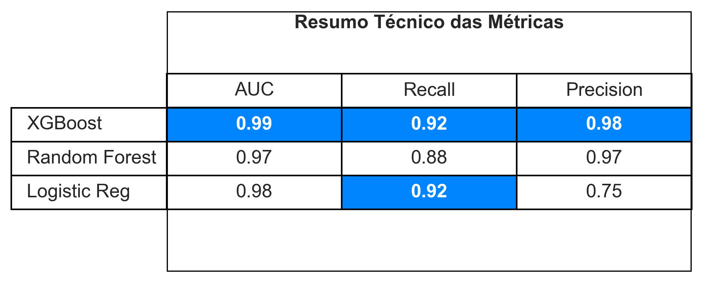

# Project_AML 

# :warning: Disclaimer de Dados / LGPD  

Este projeto utiliza dados 100% sintéticos gerados programaticamente utilizando a biblioteca Faker e scripts de lógica customizada. Nenhuma informação real de clientes, transações ou instituições financeiras foi utilizada. Qualquer semelhança com nomes ou CPFs reais é mera coincidência estatística. O objetivo é puramente educacional e científico.

#  :pushpin: Visão Geral do Projeto

Este projeto simula um ambiente bancário para detectar contas utilizadas como "Laranjas" (*mules*) em esquemas de lavagem de dinheiro. Devido à natureza confidencial de dados bancários reais, desenvolvi um motor de dados sintéticos capaz de gerar padrões complexos de fraude (*smurfing*, repasse rápido, ciclos fechados) misturados a comportamentos legítimos ("Zona Cinzenta").

O objetivo final não é apenas classificar fraudes, mas reduzir o custo operacional de compliance, diminuindo falsos positivos sem comprometer a segurança regulatória.

# :briefcase: O Problema de Negócio
A lavagem de dinheiro custa trilhões à economia global. Bancos enfrentam dois grandes desafios:

1. Multas Regulatórias: Falhar em detectar grandes esquemas.

2. Fricção com o Cliente: Bloquear contas honestas por engano (Falsos Positivos).

**Solução Proposta**: Utilizar **Teoria dos Grafos** para mapear relacionamentos entre contas e **Machine Learning** para identificar padrões comportamentais de laranjas, superando a eficácia de regras estáticas tradicionais.

# :wrench: Técnologias Utilizadas

**Linguagem**: Python 3.11

**Geração de Dados**: Faker, Random

**Análise de Grafos**: NetworkX (Graus de Entrada/Saída)

**Machine Learning**: XGBoost, Random Forest, Logistic Regression (Scikit-Learn)

**Visualização**: Matplotlib, Seaborn (e Power BI para dashboard executivo)

# :gear: Engenharia de Dados Sintéticos

Como dados reais de AML (Anti Money Laundering) são protegidos por sigilo bancário, criei o script generate_synthetic_data.py que gera um dataset realista com 100k+ transações.

Observação Técnica: Para evitar que o modelo trapaceasse ou "colasse" (tivesse 100% de acurácia artificial), implementei uma lógica de "Zona Cinzenta":

- **Honestos Gastadores**: Clientes legítimos que movimentam altos valores rapidamente (compras de bens).

- **Laranjas "Sleeping"**: Contas fraudulentas que retêm o dinheiro por dias antes do repasse, quebrando regras simples de tempo.

# :bar_chart: Análise Exploratória de Dados e Grafos (EDA)

Utilizei o **NetworkX** para transformar tabelas de transações em um Grafo Direcionado (MultiDiGraph). Isso permitiu extrair features que modelos tabulares ignoram como:

- **In-Degree/Out-Degree**: Volume de conexões únicas.

- **Pass-through Ratio**: Razão entre dinheiro recebido e enviado.

- **Average Retention Time**: Tempo médio que o dinheiro fica na conta.

# :robot: Modelagem e Estratégia

Utilizei uma abordagem *Challenger vs. Champion* para selecionar o melhor modelo, lidando com o desbalanceamento de classes (fraudes são raras).

O modelo escolhido foi o **XGBoost**, pois possui a melhor pontuação AUC ( o modelo realmente aprendeu e não está chutando),  a  melhor sensibilidade (apenas 8% dos laranjas escapam da detecção) e a melhor precisão (apenas 2% são  falsos positivos). Fatores que compensam consideravelmente, uma vez que o custo do falso positivo (risco reputacional) é elevado.

# :money_bag: Resultados e Impacto Estratégico

- **Blindagem Regulatória**: O modelo detectou 92% de todas as movimentações ilícitas. Isso reduz drasticamente o risco de multas do Banco Central por falha de compliance.

- **Eficiência Operacional**: Apenas 2% dos alertas gerados são alarmes  falsos. Esse modelo economiza centenas de horas de analistas humanos revisando contas honestas.  

- **Priorização Inteligente**: O modelo gera um Risk Score (Probabilidade). Isso permite que a equipe de fraude foque primeiro nos casos críticos (Score > 0.90) antes que o dinheiro saia do banco.

[Exemplo de Probabilidade de Risco](assets/risk_score.PNG)

# :memo: Nota Sobre A Performance Do Modelo  

As métricas AUC e Recall obtidas são excepcionalmente altas devido à natureza sintética dos dados. Em um cenário real, fraudadores adapatam seus comportamentos para se misturarem aos usuários legítimos; muitas outras informações (das quais não tenho conhecimento) são utilizadas no treinamento do modelo; e a *profundeza* do problema seria maior (ex: uma conta laranja envia dinheiro para uma conta laranja secundária que então envia para a conta final/chefe) o que reduziria essas métricas.  

Por que este resultado é válido? O sucesso do modelo valida que ele foi capaz de aprender os padrões matemáticos de fraude (Smurfing, Ciclos Fechados, Evasão Rápida) que inseri no dataset através do script gerador. O projeto serve como Prova de Conceito (PoC) da eficácia de algoritmos baseados em árvores (XGBoost) para detectar anomalias transacionais, mesmo que em dados reais a "zona cinzenta" fosse mais ruidosa.

# :chart_with_upwards_trend: Dashboard Interativo (Power BI)  

1. [KPIs](assets/pbi1.PNG)

2. [Análise de Padrões](assets/pbi2.PNG)

3. [Performance do Modelo](assets/pbi3.PNG)

# :rocket: Como executar

1. Clone o repositório
git clone https://github.com/renatowada/project_aml.git  

2. Instale as dependências
pip install -r requirements.txt  

3. Gere os dados (opcional, pois o .csv já está na pasta)
python src/generate_synthetic_data.py  

4. Execute o notebook de modelagem notebooks/modeling.ipynb

----------------------------------------------------------
## Autor
Renato Ryuichi Wada: Cientista de Dados Júnior
[LinkedIn] www.linkedin.com/in/renato-rwada
